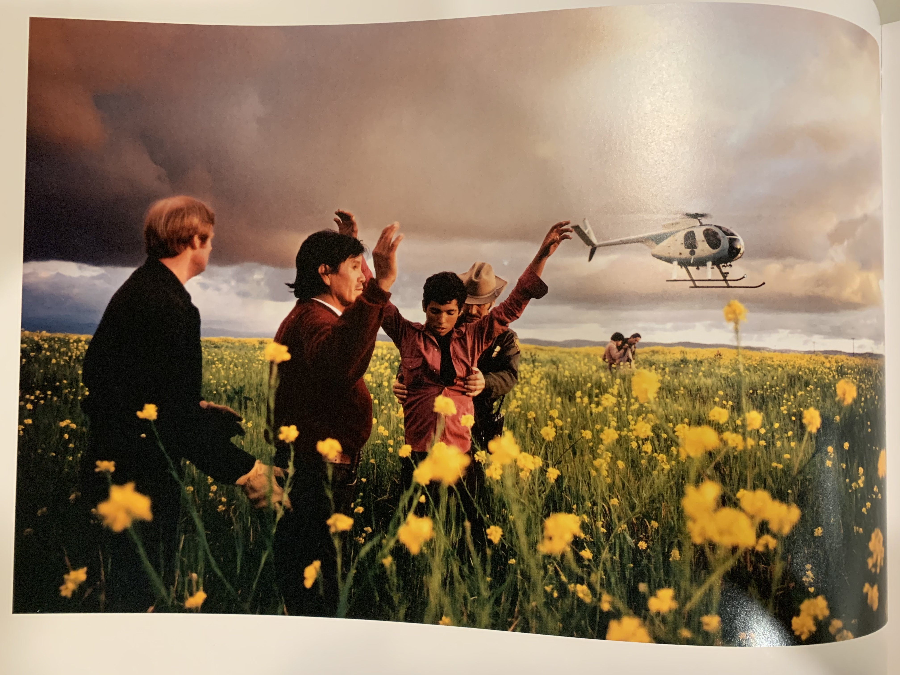
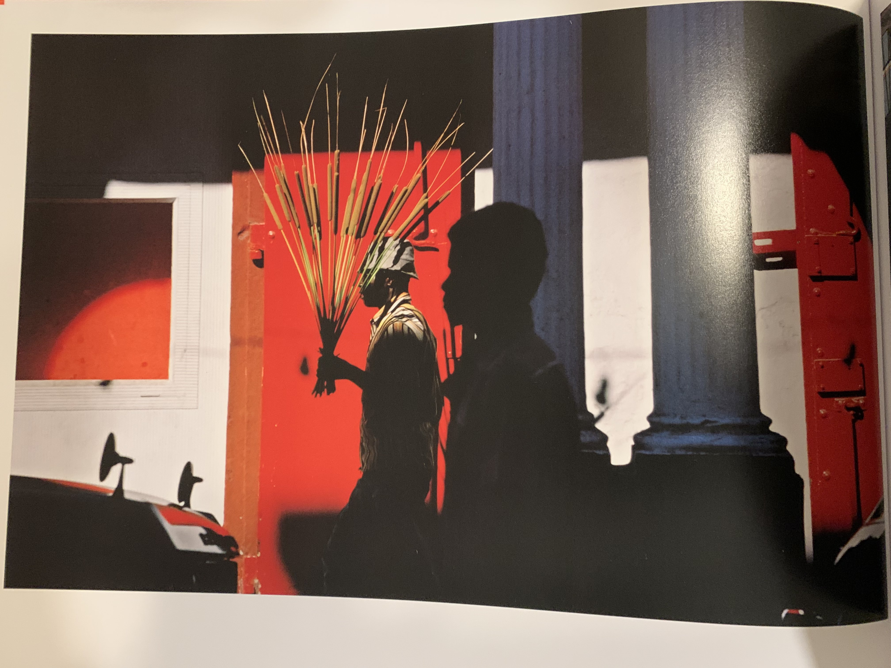
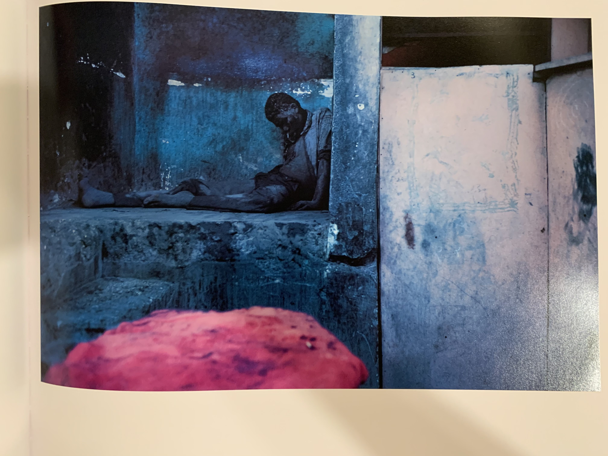

题目里”照片语言“这个词或许不恰当，照片作为对物自体（PS等技术的运用暂时不纳入讨论范围）的再现，相较其它艺术媒介缺乏语言特质。这里”语言“特指照片里承担表达作用的要素集合。

### 颜色
试图理解这本画册，以及Alex Webb的照片语言（原谅我接下来都会用到”语言“一词），让我们先从这本画册开头的一句引用说起：

> Colors are the deeds and suffering of light

这句话引自歌德，Alex Webb本人对这句话的解释是这样的：

> As I understand it, one of the tenets of Goethe's theory of color is that color emerges from the tension between light and dark, a notion that seems to resonate with my use of color, with its intense highlights and deep shadows.

这里的关键词是”tension“，颜色产生于光与暗影间的张力。这句话怎么理解？我们看几张图：

在视觉语言中，遍野的黄花蕴含希望的寓意，红色的门象征热烈，粉色代表甜美、纯真。以上三种颜色分别是这三张照片中重要的颜色要素，**但在任何意义上，每个颜色所包含的象征意义在对应图像里是缺失的，** 或者说，是与照片内容产生冲突的：第一张照片通过主要人物感受到的是希望的破灭，第二张是冷漠，第三张是破败。照片主要氛围和颜色产生了强烈冲突，在这种冲突中张力得以显现。在回到上面提到的“颜色产生于光与暗影间的张力”，这里的”光“或许是理想，而暗影却是现实。

当然，Alex Webb照片中的颜色不仅仅作为其象征意义的对立面呈现。在一些照片中，颜色回归了它本来的象征意义；还有一些照片中，颜色要素塑造了一种近乎超现实的观感，比如这张

但这里不对颜色作更多的讨论。

### 复杂构图
提到Alex Webb不得不提他的复杂构图。我们来感受一下：

这张照片看上去非常“乱”，我们的眼睛似乎没有一个合适的落脚点，于是我们绝望的看看这里，再看看那里，试图弄明白摄影师为什么要在这个角度和这个瞬间按下快门键。

让我们先看看是什么给了我们“复杂”的感受：首先，照片中包含许多颜色，而这些颜色分布在色环（如果没有接触过色环，可以想象一个“红橙黄绿青蓝紫”的环）各处、饱和度各不相同，在各种意义上都不构成统一性；其次，照片由许许多多的“形状”构成（直线、环、三角形、半长方形…），而这些形状似乎不遵循某种规律；最后，画面明中有暗、暗中带明。

列举了构成复杂的要素之后，下一个问题自然是：在这种复杂之中，是否存在某种形式的规范？我认为答案是肯定的。仔细看照片里的形状，我们或许会发现这些散乱的形状也充当了画框作用。举例来说，橙黄的半圆是白衣男孩的画框，右上角的锥状结构充当了蓝色牛仔裤男孩的画框，前景少年的腿充当了少年自己的影子和背景荡秋千人的画框，前景浅蓝色框跟右面橙黄色框之间的负空间充当了另一个荡秋千女孩的画框…但值得一提的是，不论从形状、颜色、还是明暗的角度，各个画框之间是互相“侵犯”的，画面中没有独立存在的画框。之前我们提到看这张照片时眼睛很难找到落脚点，我觉得这正是摄影师的用意所在。不同于一般的照片，**这张照片中“主角”的概念是缺失的。也就是说，没有一个个体（或位置）是照片想让我们关注的，但同时，每一个个体都是照片想让我们关注的。**这些个体是独立的、同时又是相互影响的。我想，这大概是“复杂”的核心意义所在，照片向我们展现了每一个独立的个体，这些个体或沉思、或惊奇，或怀有敌意，有的甚至无法分别。但在某一瞬间，**他们共同存在在世界某处，共同构成了世界的复杂性。**

### 画中画
这本画册有许多画中画的例子，比如下面两张：

两张照片在感受上有些相似，我们只拿第一张来说明。照片里一个人手上拿着一面镜子，镜子里反射出摄影师身后的空间：草地、残破的建筑、远山，照片边缘是两名士兵。或许因为有实物作画框的原因，镜子里的图片真的像一幅画，盯着它看了一会仿佛进入一个非现实的世界，这个世界如梦般静谧。**但是，画框中心的手臂和边缘的红色又不断把我们拉回现实，**拉回现实中的战争、困惑。在这里，画中画充当了一种穿越到另一个世界的媒介，而当我们意识又回到现实中的时候，现实世界里的冲突就更显激烈了。

### 画框
Alex Webb非常善于捕捉眼前可以用来当画框的要素，比如这两张：

画框应该放在构图里一并说，但这里单独拿出来是因为我觉得摄影师对画框的使用不单单是构图上的考量。还是拿第一张举例子。照片中有三个人，卖爆米花的亭子充当了画框，同时把画面分成了四部分。这里画框的使用我认为非常巧妙。如果经常看照片，我们或许会发现，**照片本身带有一种把所含事物和人强行归类的暴力。**在同一张照片中，完全没有关系的两个人似乎也不可避免的带有某种“共同性”。**但画框的出现又暴力的阻断了这种“共同性”。**让我们想象一下把中间的爆米花亭去掉。这时，三个人的身体所向构成三角形的连线，我们很难把照片左边和右边的男人看成两个完全独立的个体。**但画框的出现提供了视觉的不连续，而视觉的不连续又造成了心理上的不连续。**

### 结语
这本画册集结了Alex Webb 30年的照片，其复杂性和可欣赏性完全不止以上四点。但我觉得写多了可能会起反作用，于是在这里打住。另外，因为他单张照片承载的信息非常足，所以在画册编排方面的一些小细节我也没有放到这篇文章里。不过，这里单独要提一张我本人非常喜欢的照片：

这张照片在画册比较靠近尾声的地方，摄影师巧妙的构图让小女孩成了这张照片绝对的主角。对我来讲，这张照片好像是经历了前面诸多的痛苦之后的安慰和救赎。好像是在对我们说，**尽管外面的世界复杂、吵闹，但我们仍保持着内心的单纯和美好，而这份单纯和美好在我们看见粉色的棉花糖和小女孩天真的笑脸之后短暂的战胜了生活一切的阴暗面，变成了一瞬的光。**
